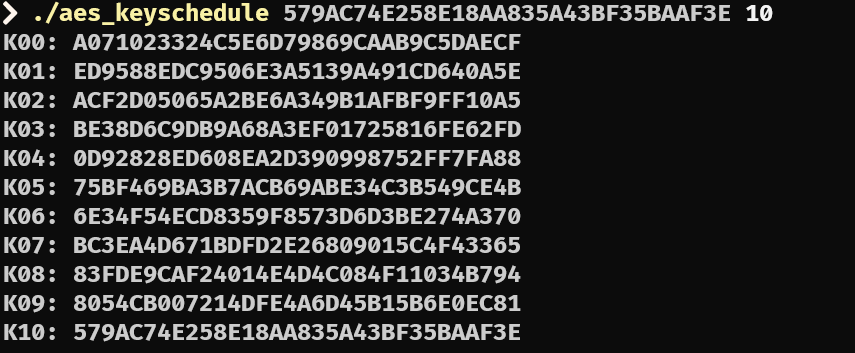

# Crypto

## Topic

## 

[DFA还原白盒AES密钥](https://www.zskkk.cn/posts/15785/)

```
from phoenixAES import crack_file
import subprocess

# 1. 生成tracefile（含1组正确密文+16组错误密文）
# with open('tracefile', 'wb') as f:
#     f.write("""
# 15b65ab84bd67ec241f34ae6dcc9abc2
# 07b65ab84bd67e1d41f394e6dc9fabc2
# 78b65ab84bd67e7141f377e6dc75abc2
# 41b65ab84bd67e1141f343e6dc98abc2
# 7cb65ab84bd67eed41f309e6dcfaabc2
# 15165ab8a5d67ec241f34ade07c9bcc2
# 151f5ab833d67ec241f34ac1dcc9d6c2
# 15435ab81bd67ec241f34ab3dcc9d4c2
# 15c55ab8c9d67ec241f34acadcc940c2
# 15b6aab84bc87ec2f6f34ae6dcc9abcc
# 15b64eb84b3d7ec203f34ae6dcc9ab8b
# 15b60bb84bb17ec28ff34ae6dcc9ab2e
# 15b65cb84b087ec266f34ae6dcc9abe8
# 15b65a184bd65ac241154ae607c9abc2
# 15b65aaa4bd67ac241fa4ae6cec9abc2
# 15b65ab24bd693c241ff4ae670c9abc2
# 15b65a9b4bd6e6c241714ae66ec9abc2
# """.encode('utf8'))

# crack_file('tracefile')
#
#
# crack_file('tracefile', verbose=True)

round_key = "579AC74E258E18AA835A43BF35BAAF3E"

# Stark

#  ./aes_keyschedule 579AC74E258E18AA835A43BF35BAAF3E 10
# K00: A071023324C5E6D79869CAAB9C5DAECF
# K01: ED9588EDC9506E3A5139A491CD640A5E
# K02: ACF2D05065A2BE6A349B1AFBF9FF10A5
# K03: BE38D6C9DB9A68A3EF01725816FE62FD
# K04: 0D92828ED608EA2D390998752FF7FA88
# K05: 75BF469BA3B7ACB69ABE34C3B549CE4B
# K06: 6E34F54ECD8359F8573D6D3BE274A370
# K07: BC3EA4D671BDFD2E26809015C4F43365
# K08: 83FDE9CAF24014E4D4C084F11034B794
# K09: 8054CB007214DFE4A6D45B15B6E0EC81
# K10: 579AC74E258E18AA835A43BF35BAAF3E

from Crypto.Cipher import AES

key_hex = "A071023324C5E6D79869CAAB9C5DAECF"
ciphertext_hex = "2748abe0ec0dc345c55b656b7a1891397dd72460baae29726cfdb14078beccb0"

key = bytes.fromhex(key_hex)
ciphertext = bytes.fromhex(ciphertext_hex)

cipher = AES.new(key, AES.MODE_ECB)
plaintext = cipher.decrypt(ciphertext)

print("解密结果:", plaintext)

# flag{l0_add2?_DFA}\x0e\x0e\x0e\x0e\x0e\x0e\x0e\x0e\x0e\x0e\x0e\x0e\x0e\x0e'
```



