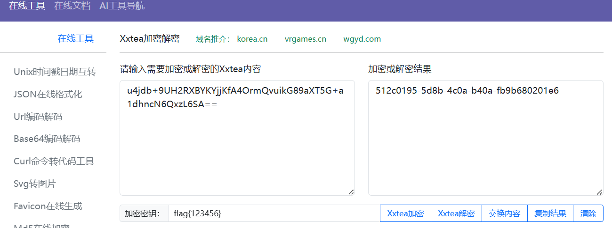
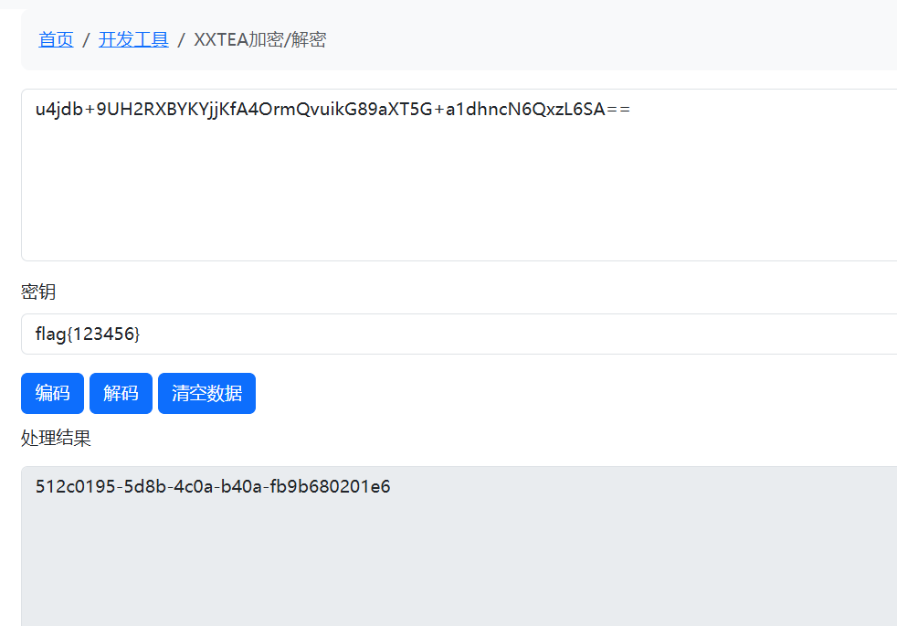

#

#

```
import base64
import struct

def xxtea_decrypt(ciphertext: bytes, key: bytes) -> bytes:
    key = key.ljust(16, b'\0')[:16]
    key_arr = struct.unpack("<4I", key)  
    
    v = list(struct.unpack("<%dI" % (len(ciphertext)//4), ciphertext))
    n = len(v)
    if n < 1:
        return ciphertext
    
    delta = 0x9E3779B9
    rounds = 6 + 52 // n
    sum_ = (delta * rounds) & 0xFFFFFFFF
    
    y = v[0]
    for _ in range(rounds):
        e = (sum_ >> 2) & 3
        for p in range(n-1, 0, -1):
            z = v[p-1]
            v[p] = (v[p] - (
                ((z >> 5 ^ y << 2) + (y >> 3 ^ z << 4)) ^ 
                ((sum_ ^ y) + (key_arr[(p & 3) ^ e] ^ z))
            )) & 0xFFFFFFFF
            y = v[p]
        z = v[n-1]
        v[0] = (v[0] - (
            ((z >> 5 ^ y << 2) + (y >> 3 ^ z << 4)) ^ 
            ((sum_ ^ y) + (key_arr[(0 & 3) ^ e] ^ z))
        )) & 0xFFFFFFFF
        y = v[0]
        sum_ = (sum_ - delta) & 0xFFFFFFFF
    
    return b''.join(struct.pack("<I", num) for num in v)

encrypted_b64 = "u4jdb+9UH2RXBYKYjjKfA4OrmQvuikG89aXT5G+a1dhncN6QxzL6SA=="
key = b"flag{123456}"

ciphertext = base64.b64decode(encrypted_b64)
plaintext = xxtea_decrypt(ciphertext, key)

flag = plaintext.rstrip(b"\x00").decode("utf-8")
print("Decrypted Flag:", flag)

# 512c0195-5d8b-4c0a-b40a-fb9b680201e6$
```

```
# https://xiaoai.me/pages/dev-xxteacrypt
# -1640531527
# https://sbox.cn/tool/xxtea
```




